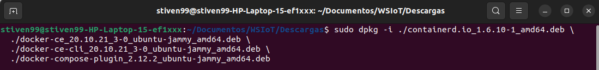
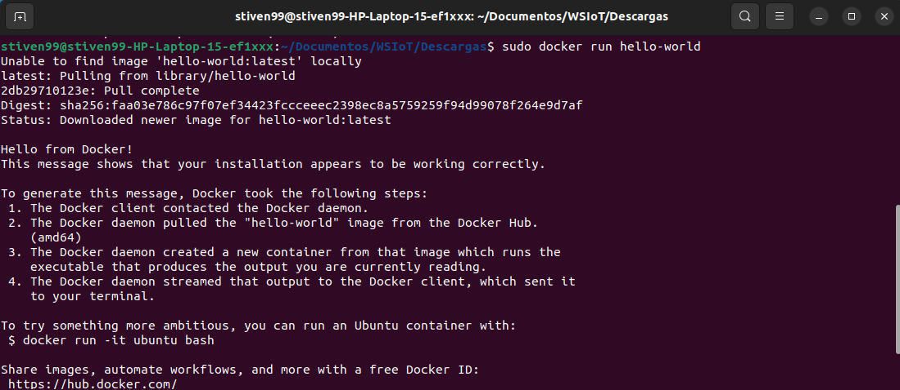

# Práctica 1: Configuración de entorno y red

## Secciones

  - [Instalación  de Docker](#instalación-de-docker)
  - [Reconocimiento de herramientas de red](#reconocimiento-de-herramientas-de-red)

---

## Instalación  de Docker

1. Para este caso se hace la instalación para Ubuntu 22.04, se descargan los .deb usando el siguiente link: https://download.docker.com/linux/ubuntu/dists/, luego se debe ir a "pool/stable/" y escoger la rquitectura "amd64", despues de ello ya aparecen los .deb y se descargan.
   
2. Se instalan los .deb desde la terminal como se muestra en la siguiente figura.
   
   

3. Finalmente se verifica que la instalación de Docker Engine es exitosa ejecutando la "hello-world" imagen, como se muestra en la siguiente figura.
   
   

---

## Reconocimiento de herramientas de red