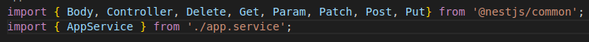
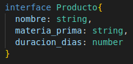
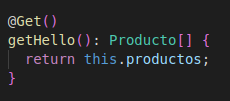
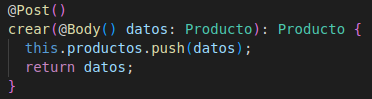
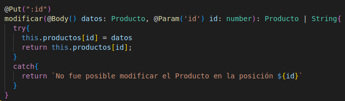
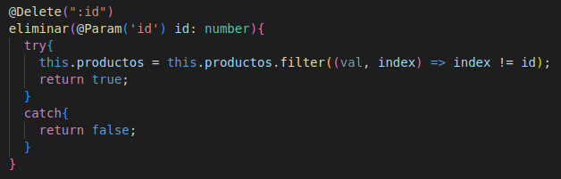
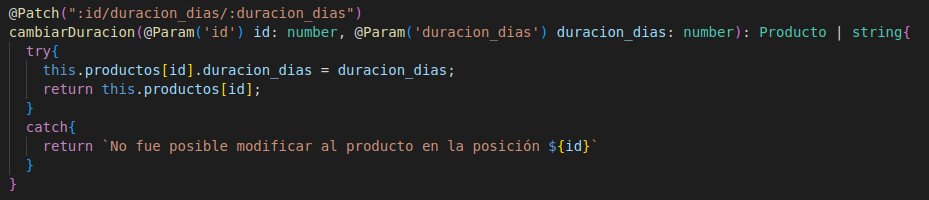

  

[circleci-image]: https://img.shields.io/circleci/build/github/nestjs/nest/master?token=abc123def456
[circleci-url]: https://circleci.com/gh/nestjs/nest

  
A progressive <a href="http://nodejs.org" target="_blank">Node.js</a> framework for building efficient and scalable server-side applications.

    

  
    
  

  <!--
  -->

# Practicas-SWoT

 Edwin Stiven Molina Arias

 Asignatura: Web Semantica de Internet de las cosas

## Secciones

  - [Practica 2](#practica-2)

---
  
## Practica 2
Fecha de realización: 27 de noviembre de 2022

1. Se importan la anotaciones "@Post, @Put(), @Delete(), @Patch()" como se muestra en la siguiente figura.

2. Se escoje un tema para modelar como base de datos, el tema escogido es "productos", y se crea como se miestrae en la siguiente figura.
   

3. Se agrega un producto como se muestra en la siguiente figura.
   

4. Se crea la anotacion @Get, la cual se usa para retornar la información de los productos que hay en la base de datos, como se muestra en la siguiente figura.
   

5. Se crea la anotacion @Post, la cual se usa para crear un Producto, el cual se guarda la información en "datos" que luego se envia a productos para que se guarde en la base de datos, y finalmente se retorna la información se ingresó sobre el nuevo producto, como se muestra en la siguiente figura.
   

6. Se crea la anotacion @Put, la cual se usa para Actualizar un Producto, el cual se guarda la información en "datos" e ingresando la posición donde se encuentra el producoto que se quiere actualizar y se guarda en "id", que luego se actualiza en productos , y finalmente se retorna la información se ingresó para actaulizar el producto, y en caso tal de que se produzca un error se retorna un mensaje de que no se pudo hacer la modificación, como se muestra en la siguiente figura.
   

7. Se crea la anotacion @Delet, la cual se usa para Eliminar un Producto, el cual se guarda en "id" la posición del producto que se quiere eliminar, y finalmente se retorna "true" si se eliminó correctamente, y en caso tal de que no se haya eliminado se retorna "false", como se muestra en la siguiente figura.
   

8. Se crea la anotacion @Patch, la cual se usa para Actualizar la duracion del producto, el cual se guarda la información en "duracion_dias" e ingresando la posición donde se encuentra el producoto que se quiere actualizar y se guarda en "id", que luego se actualiza en productos , y finalmente se retorna la información del producto que se actaulizó, y en caso tal de que se produzca un error se retorna un mensaje de que no se pudo hacer la modificación, como se muestra en la siguiente figura.
   

## License

Nest is [MIT licensed](LICENSE).
